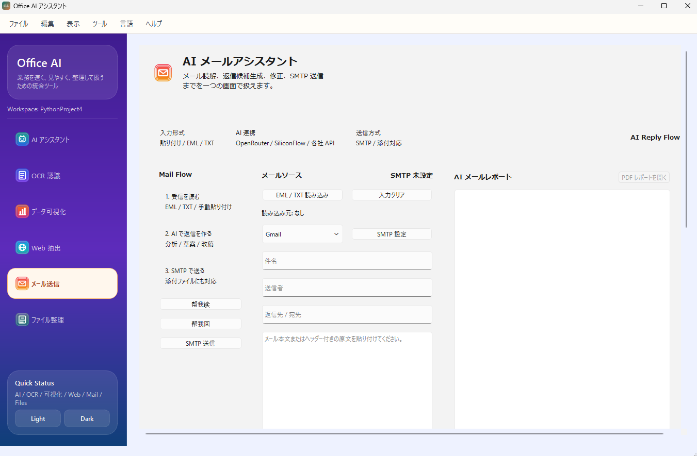

<div align="center">

# Office AI アシスタント

業務で使う **AI 分析 / OCR / データ可視化 / Web 抽出 / メール支援 / ファイル整理** を  
ひとつのデスクトップアプリに統合した、Office 向け AI ワークスペースです。


</div>

---

## 概要

Office AI アシスタントは、日々の事務作業や情報整理を効率化するための統合ツールです。  
単体の機能を並べるだけではなく、各モジュールを **共通の UI とレポート形式** でつなぎ、次のような作業をまとめて扱えるようにしています。

- テキスト、URL、ファイルを使った AI 分析
- 帳票や非定型文書の OCR 認識
- CSV / Excel の可視化と AI 解説
- Web ページ本文の抽出と保存
- メール読解、返信案作成、SMTP 送信
- フォルダ分析、重複検出、Space Lens 可視化

アプリ全体は **左ナビゲーション / 中央操作エリア / 右レポートエリア** の三分割構成で統一しています。

---

## 主な機能

### AI ワークスペース

- 要約
- TODO 抽出
- 議事録整理
- 改善案生成
- ワークスペース分析
- CSV / Excel 異常値確認
- OCR 結果の再整理
- テキスト / URL / ファイルの複合入力
- 外部 AI API による結果強化

### AI-OCR ワークスペース

- 全文 OCR
- 定型帳票解析
- 非定型文書解析
- OCR 結果の整理保存
- RPA 向け JSON 出力
- AI API による再分析

### データ可視化

- 棒グラフ
- 折れ線グラフ
- 円グラフ
- ワードクラウド
- AI 解説付きレポート
- PDF レポート出力

### Web 抽出

- URL から本文抽出
- テキスト保存
- PDF 保存
- AI による要約と整理

### AI メールアシスタント

- メール本文読解
- 返信案生成
- 文面修正
- EML / TXT 読み込み
- SMTP 設定
- 添付付き送信

### ファイル整理

- フォルダ分析
- Space Lens 可視化
- 大型 / 旧ファイル抽出
- 名前検索 / 内容検索
- 重複ファイル検出
- 拡張子ごとの整理
- バッチリネーム
- テンプレートファイル作成
- ZIP / TAR 系アーカイブ一覧

### AI API 設定

- OpenRouter / SiliconFlow / 互換 API 切替
- Base URL / Model / API Key / Timeout 設定
- 接続テスト
- 一括診断
- 推奨設定の自動適用

---

## 画面イメージ

### AI ワークスペース


### AI-OCR ワークスペース


### データ可視化


### Web 抽出


### AI メールアシスタント



### ファイル整理


### AI API 設定


---

## 想定ユースケース

### 事務・総務・経理

- 請求書、領収書、申請書の OCR 認識
- 保存用 JSON / テキストの出力
- 帳票内容の要点整理

### 営業・カスタマーサポート

- 受信メールの読解
- 返信文の下書き作成
- Web ページからの情報抽出

### マネージャー・リーダー

- 議事録から TODO 抽出
- 課題整理
- 改善案作成
- データ可視化レポート作成

### 個人 PC 整理

- 大きなファイルの把握
- 古いファイルの発見
- 重複検出
- フォルダ傾向の可視化

---

## 対応 AI API

本アプリの外部 AI 連携は `/v1/chat/completions` 互換 API を前提としています。

### 確認済みの切替候補

- OpenRouter
- SiliconFlow
- DeepSeek 互換 API
- GLM 互換 API
- Qwen 互換 API
- Kimi 互換 API
- MiniMax 互換 API

### AI API 設定でできること

- 接続テスト
- 一括診断
- モデル名チェック
- API Key の有無確認
- Base URL 検証
- タイムアウト調整

---

## 技術スタック

| 分類 | 内容 |
|---|---|
| GUI | PySide6 |
| OCR | pytesseract / Pillow / Tesseract OCR |
| 可視化 | matplotlib / pandas / wordcloud / openpyxl |
| Web 抽出 | requests / beautifulsoup4 / popdf |
| メール | smtplib / email |
| AI API | requests ベースの互換 API クライアント |
| ファイル管理 | pathlib / shutil / zipfile / tarfile |

---

## インストール

### 1. リポジトリ取得

```bash
git clone https://github.com/yourname/office-ai-assistant.git
cd office-ai-assistant
```

### 2. 仮想環境作成

```bash
python -m venv .venv
```

Windows:

```bash
.venv\Scripts\activate
```

macOS / Linux:

```bash
source .venv/bin/activate
```

### 3. 依存関係インストール

```bash
pip install -r requirements.txt
```

### 4. Tesseract OCR 導入

Windows:

- [UB Mannheim Tesseract](https://github.com/UB-Mannheim/tesseract/wiki)

macOS:

```bash
brew install tesseract tesseract-lang
```

Ubuntu / Debian:

```bash
sudo apt install tesseract-ocr tesseract-ocr-jpn
```

---

## 起動方法

```bash
python main.py
```

---

## テスト

```bash
python -m unittest discover -s tests -v
```

---

## プロジェクト構成

```text
office-ai-assistant/
├─ main.py
├─ requirements.txt
├─ README.md
├─ CHANGELOG.md
├─ generate_icons.py
├─ img/
├─ docs/
├─ logs/
├─ output/
├─ samples/
├─ src/
│  ├─ config.py
│  ├─ compatibility.py
│  ├─ core/
│  │  ├─ ai_assistant.py
│  │  ├─ email_ai_assistant.py
│  │  ├─ email_sender.py
│  │  ├─ file_manager.py
│  │  ├─ llm_client.py
│  │  ├─ ocr_engine.py
│  │  ├─ visualization.py
│  │  └─ web_extractor.py
│  ├─ ui/
│  │  ├─ main_window.py
│  │  ├─ resources/
│  │  │  ├─ icons/
│  │  │  └─ style.qss
│  │  ├─ tabs/
│  │  │  ├─ ai_tab.py
│  │  │  ├─ email_tab.py
│  │  │  ├─ file_tab.py
│  │  │  ├─ ocr_tab.py
│  │  │  ├─ viz_tab.py
│  │  │  └─ web_tab.py
│  │  └─ widgets/
│  │     ├─ api_settings.py
│  │     └─ rich_result_panel.py
│  └─ utils/
│     ├─ i18n.py
│     └─ logger.py
└─ tests/
   ├─ test_ai_assistant.py
   ├─ test_email.py
   ├─ test_email_ai.py
   ├─ test_file_manager.py
   ├─ test_llm_client.py
   ├─ test_ocr.py
   └─ test_ui_language.py
```

---

## 現時点の強み

- 複数の業務機能をひとつのデスクトップ UI に統合している
- OCR / AI / 可視化 / メール / ファイル整理が相互につながる
- AI API を 1 社固定ではなく差し替えやすい
- レポートベースの運用に向いた構成になっている

---

## 現在の課題

- 一部機能はさらに異常系テストを厚くする必要がある
- OCR の帳票精度は引き続き改善余地がある
- ファイル整理の可視化表現は今後さらに強化可能
- Web / OCR / AI / File の結果テンプレートは今後さらに統一できる

---

## 次にやるべきこと

次の作業方針は以下のドキュメントに整理しています。

- [Project Roadmap](docs/PROJECT_ROADMAP.md)
- [QA Stability Checklist](docs/QA_STABILITY_CHECKLIST.md)
- [Known Issues](docs/KNOWN_ISSUES.md)
- [Bug Tracking](docs/BUG_TRACKING.md)
- [Stabilization Report](docs/STABILIZATION_REPORT.md)

---

## ライセンス

MIT License
