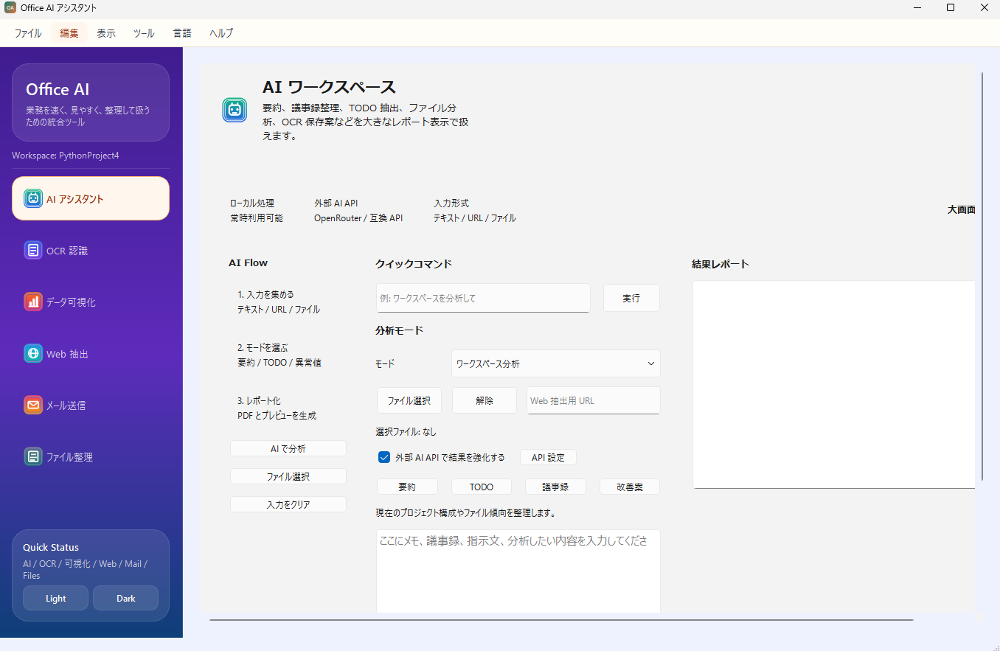
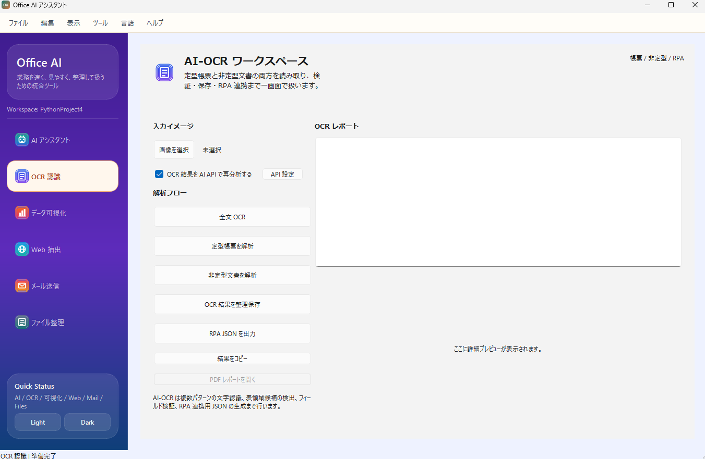
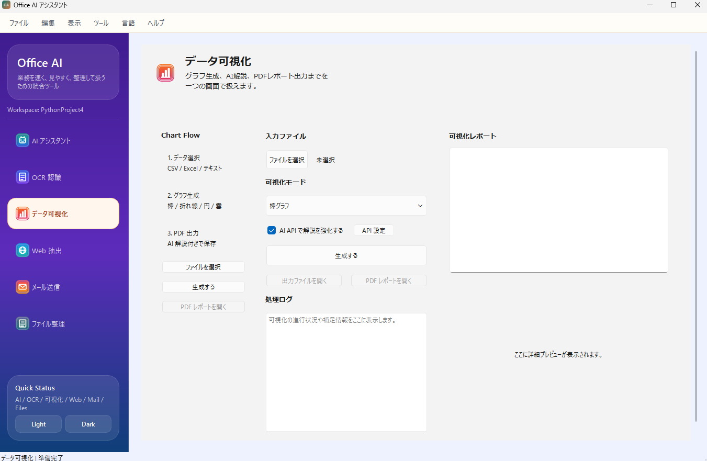
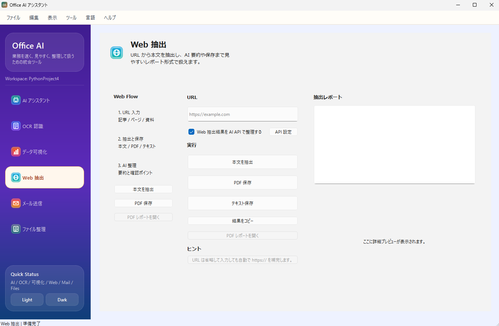
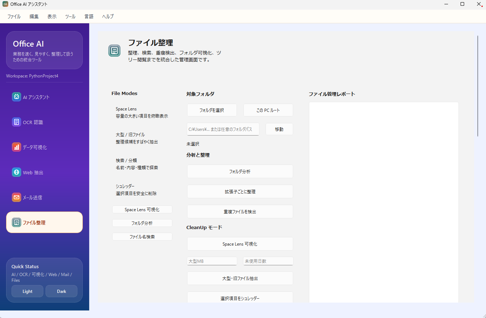
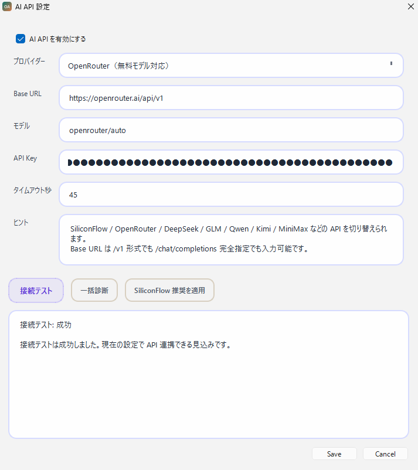

# Office AI アシスタント

Office AI アシスタントは、日常業務で使う **AI 分析 / OCR / データ可視化 / Web 抽出 / AI メール支援 / ファイル整理** を 1 つにまとめたデスクトップツールです。  
PySide6 ベースの GUI で、レポート表示・PDF 出力・外部 AI API 連携・OCR 保存整理まで一連の作業をまとめて扱えます。

## 主な特徴

- `AI ワークスペース`
  - 要約、TODO 抽出、議事録整理、改善案生成、CSV / Excel 異常値確認、OCR 保管案の整理
- `AI-OCR ワークスペース`
  - 全文 OCR、帳票解析、非定型文書解析、RPA 向け JSON 出力、整理保存
- `データ可視化`
  - 棒グラフ、折れ線、円グラフ、ワードクラウド生成
  - AI 解説付きレポートと PDF 出力
- `Web 抽出`
  - URL から本文抽出、テキスト保存、PDF 保存、AI 整理
- `AI メールアシスタント`
  - メール読解、返信案作成、文面修正、SMTP 送信
- `ファイル整理`
  - フォルダ分析、拡張子ごとの整理、重複検出、Space Lens 可視化
  - パス入力移動、バッチリネーム、テンプレートファイル作成、ZIP / TAR 系アーカイブ一覧
- `AI API 設定`
  - 接続テスト、一括診断、プロバイダー切り替え
  - OpenRouter / SiliconFlow / 各種互換 API に対応

## 画面イメージ

現在の README では、リポジトリ内に保存済みの最新キャプチャを掲載しています。

| 画面          | プレビュー                          |
|-------------|--------------------------------|
| AI ワークスペース  |   |
| AI-OCR      |  |
| データ可視化      |       |
| web抽出       |       |
| AIメールアシスタント |        |
| ファイル整理      |       |
| API 設定      |     |

## モジュール構成

| モジュール | 概要 | 主なライブラリ |
|---|---|---|
| AI ワークスペース | 要約、TODO、改善案、異常値確認などの統合分析 | `porobot`, `pandas`, `requests` |
| OCR | 全文 OCR、帳票解析、非定型文書整理、RPA JSON | `pytesseract`, `Pillow` |
| データ可視化 | グラフ / ワードクラウド生成、AI 解説、PDF 化 | `matplotlib`, `wordcloud`, `pandas` |
| Web 抽出 | 本文抽出、AI 整理、PDF / テキスト保存 | `requests`, `beautifulsoup4`, `popdf` |
| AI メール | 読解、返信案作成、SMTP 送信 | `smtplib`, `email` |
| ファイル整理 | フォルダ分析、Space Lens、検索、重複検出、リネーム | `pathlib`, `shutil`, `zipfile`, `tarfile` |

## AI API 連携

アプリ内の `API 設定` ダイアログから、外部 AI プロバイダーを切り替えられます。

- OpenRouter
- SiliconFlow
- DeepSeek 互換 API
- GLM 互換 API
- Qwen 互換 API
- Kimi 互換 API
- MiniMax 互換 API
- `/v1/chat/completions` 互換の各種 API

利用できる機能:

- 接続テスト
- 一括診断
- Base URL / モデル / API Key の個別設定
- タイムアウト秒数の調整え

## ファイル整理でできること

現在の `ファイル整理` タブでは、次の実用機能を使えます。

- フォルダ全体を再帰走査して大きい項目を集計
- Space Lens レポートを生成
- 名前検索 / 内容検索
- 拡張子ごとの分類
- 重複ファイル検出
- パス手入力 + 自動補完での移動
- 正規表現対応のバッチリネーム
- リネーム前プレビュー
- テキスト / Markdown / CSV / JSON / Python のテンプレート作成
- ZIP / TAR / TGZ / TAR.GZ などの一覧参照

## OCR でできること

- 全文 OCR
- 定型帳票解析
- 非定型文書解析
- OCR 結果の整理保存
- RPA 向け JSON 出力
- 外部 AI API での再分析

## データ可視化でできること

- CSV / Excel / テキストの読み込み
- 棒グラフ / 折れ線 / 円グラフ / ワードクラウド
- AI API を使ったグラフ解説
- PDF レポート出力

## 動作環境

| 項目 | 内容 |
|---|---|
| OS | Windows 10 / 11 推奨 |
| Python | 3.10 以上を推奨 |
| GUI | PySide6 |
| OCR | Tesseract OCR が必要 |

## インストール

### 1. リポジトリ取得

```bash
git clone https://github.com/yourname/office-ai-assistant.git
cd office-ai-assistant
```

### 2. 仮想環境作成

```bash
python -m venv .venv
```

Windows:

```bash
.venv\Scripts\activate
```

macOS / Linux:

```bash
source .venv/bin/activate
```

### 3. 依存関係インストール

```bash
pip install -r requirements.txt
```

### 4. Tesseract OCR を導入

- Windows: [UB Mannheim Tesseract](https://github.com/UB-Mannheim/tesseract/wiki)
- macOS:

```bash
brew install tesseract tesseract-lang
```

- Ubuntu / Debian:

```bash
sudo apt install tesseract-ocr tesseract-ocr-jpn
```

Windows で Tesseract の場所を明示したい場合は、`src/core/ocr_engine.py` 側の設定を環境に合わせて調整してください。

## 起動方法

```bash
python main.py
```

## テスト

```bash
python -m unittest discover -s tests -v
```

## ディレクトリ構成

```text
office-ai-assistant/
├─ main.py
├─ requirements.txt
├─ README.md
├─ generate_icons.py
├─ img/
├─ logs/
├─ output/
├─ samples/
├─ src/
│  ├─ config.py
│  ├─ compatibility.py
│  ├─ core/
│  │  ├─ ai_assistant.py
│  │  ├─ email_ai_assistant.py
│  │  ├─ file_manager.py
│  │  ├─ llm_client.py
│  │  ├─ ocr_engine.py
│  │  ├─ visualization.py
│  │  └─ web_extractor.py
│  ├─ ui/
│  │  ├─ main_window.py
│  │  ├─ resources/
│  │  │  ├─ icons/
│  │  │  └─ style.qss
│  │  ├─ tabs/
│  │  │  ├─ ai_tab.py
│  │  │  ├─ email_tab.py
│  │  │  ├─ file_tab.py
│  │  │  ├─ ocr_tab.py
│  │  │  ├─ viz_tab.py
│  │  │  └─ web_tab.py
│  │  └─ widgets/
│  │     ├─ api_settings.py
│  │     └─ rich_result_panel.py
│  └─ utils/
│     ├─ i18n.py
│     └─ logger.py
└─ tests/
   ├─ test_ai_assistant.py
   ├─ test_email.py
   ├─ test_email_ai.py
   ├─ test_file_manager.py
   ├─ test_llm_client.py
   ├─ test_ocr.py
   └─ test_ui_language.py
```

## 現在の実装メモ

- デフォルト表示言語は日本語
- 画面切り替え時はタブを安全に再構築
- 外部 AI API が失敗しても、ローカル処理は継続できる設計
- README の説明は現在の実装に合わせて更新済み

## ライセンス

MIT License
